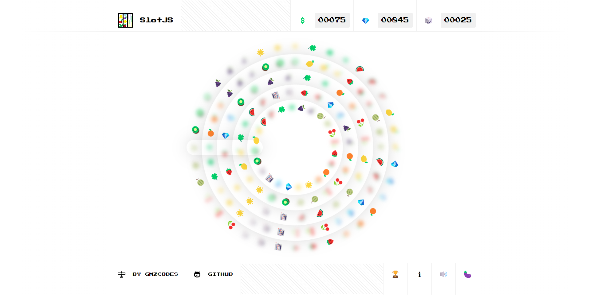

    🎰 Gaming for Good - with a "lossless" casino

    🚀 Try it out at <a href="https://viceroll.casino">viceroll.casino</a>!

<

 

    

 

<h1 align="center">Hi 👋, We are the Vice Roll Team</h1>
<h3 align="center">We made a Lossless Casino built at ETH DENVER 2024 - Turn Your Vices 👿 Into Virtues 😇 In A Casino For Public Good! 🎲 🎲</h3>

- 🔭 We researched casual games - Like Slot Machines!! 

- 🌱 We tested our fist fork game with Javascript, online at https://viceroll.casino/

- 🌱 We made a DAO to receive gaming funds used for public good, online at https://snapshot.org/#/viceroll.eth/about

- 🌱 We made a player's reward token that can be used for voting and rebasing $COPE

- 🌱 We made our gaming contract to resolve player events and token rewards on-chain, online at https://sepolia.etherscan.io/address/0xf9CA920eBE7BA15DB6F69eeab56f86F7Bc506b6a 

- 🌱 Next steps for us: Expand our players reward infrastructure (more contrats, more games, more vices => virtures)

- ⚡ Fun fact **3 of us are brand new to eth denver, and we are from 3 differnt countries**

<h3 align="left">Connect with us:</h3>

<h3 align="left">Languages and Tools:</h3>

        

<h3 align="left">Meet the team and our ETH Denver friends:</h3>

    

    

    

<h3 align="left">Learn about the game and dao:</h3>

    

    

    

